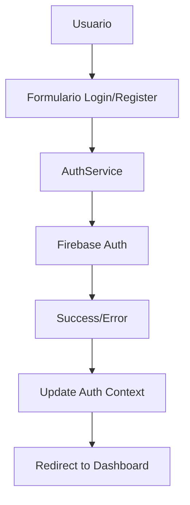

# 🇧🇴 AltaConnect

## Conectando Bolivia con el mundo

> Una plataforma de red social moderna diseñada para la comunidad boliviana

---

Una aplicación completa de red social construida con **React 19**, **Firebase v11**, **TypeScript** y **shadcn/ui**. Diseñada específicamente para conectar a la comunidad boliviana con un enfoque en cultura, tradición e innovación tecnológica.

## 🚀 Instalación y Configuración

### Prerrequisitos

- **Node.js** v18 o superior
- **pnpm** (recomendado) o npm/yarn
- **Cuenta Firebase** activa

### 1. Clonar e Instalar

```bash
# Clonar el repositorio
git clone <tu-repositorio>
cd firebase-auth

# Instalar dependencias
pnpm install
```

### 2. Configuración de Firebase

1. **Crear Proyecto Firebase**

   ```bash
   # Visita https://console.firebase.google.com/
   # Crea un nuevo proyecto
   ```

2. **Configurar Authentication**
   - Habilita Email/Password
   - Configura Google OAuth (opcional)
   - Configura GitHub OAuth (opcional)
   - Añade dominios autorizados

3. **Configurar Firestore Database**

   ```javascript
   // Reglas de seguridad recomendadas
   rules_version = '2';
   service cloud.firestore {
     match /databases/{database}/documents {
       match /users/{userId} {
         allow read, write: if request.auth != null && request.auth.uid == userId;
       }
       match /posts/{postId} {
         allow read: if request.auth != null;
         allow write: if request.auth != null && request.auth.uid == resource.data.authorUID;
       }
     }
   }
   ```

4. **Configurar Firebase Storage**

   ```javascript
   // Reglas de seguridad para Storage
   rules_version = '2';
   service firebase.storage {
     match /b/{bucket}/o {
       match /{allPaths=**} {
         allow read, write: if request.auth != null;
       }
     }
   }
   ```

### 3. Variables de Entorno

Crea un archivo `.env` en la raíz del proyecto:

```env
VITE_FIREBASE_API_KEY=tu_api_key
VITE_FIREBASE_AUTH_DOMAIN=tu_proyecto.firebaseapp.com
VITE_FIREBASE_PROJECT_ID=tu_proyecto_id
VITE_FIREBASE_STORAGE_BUCKET=tu_bucket.appspot.com
VITE_FIREBASE_MESSAGING_SENDER_ID=tu_sender_id
VITE_FIREBASE_APP_ID=tu_app_id
VITE_FIREBASE_MEASUREMENT_ID=tu_measurement_id
```

### 4. Ejecutar en Desarrollo

```bash
# Iniciar servidor de desarrollo
pnpm dev

# Abrir en el navegador
# http://localhost:5173
```

## Instalación

1. **Clonar repositorio**:

   ```bash
   git clone [url-del-repositorio]
   cd firebase-auth
   ```

2. **Instalar dependencias**:

   ```bash
   pnpm install
   # o
   npm install
   ```

3. **Configurar variables de entorno**:

   ```bash
   cp .env.example .env
   # Editar .env con tus credenciales de Firebase
   ```

4. **Iniciar desarrollo**:

   ```bash
   pnpm dev
   # o
   npm run dev
   ```

## 🛠️ Tecnologías y Dependencias

### Core

- **React 19** - Framework principal
- **TypeScript** - Tipado estático
- **Vite** - Build tool y dev server

### Firebase

- **Firebase Authentication** - Sistema de autenticación
- **Cloud Firestore** - Base de datos NoSQL
- **Firebase SDK** - Integración completa

### UI/UX

- **Tailwind CSS** - Framework de estilos
- **shadcn/ui** - Componentes accesibles
- **Lucide React** - Iconografía moderna
- **React Hook Form** - Manejo de formularios

### Estado y Navegación

- **React Router** - Enrutamiento SPA
- **Context API** - Gestión de estado global
- **Custom Hooks** - Lógica reutilizable

### Validación y Utilidades

- **Zod** - Validación de esquemas
- **Sonner** - Notificaciones toast
- **date-fns** - Manipulación de fechas

## 🏗️ Arquitectura y Patrones de Diseño

### Estructura Modular Avanzada

```text
src/
├── apps/                    # Configuración de aplicaciones externas
│   └── firebase.app.ts      # Inicialización Firebase
├── components/              # Componentes reutilizables
│   ├── auth/               # Autenticación
│   │   ├── login.form.tsx
│   │   ├── register.form.tsx
│   │   ├── link-password.form.tsx
│   │   └── provider-icon.tsx
│   ├── posts/              # Sistema de publicaciones
│   │   ├── create-post.dialog.tsx
│   │   └── user-posts.manager.tsx
│   ├── ui/                 # Design System (shadcn/ui)
│   │   ├── button.tsx
│   │   ├── input.tsx
│   │   ├── dialog.tsx
│   │   └── ...
│   └── user/               # Gestión de usuarios
├── config/                 # Configuración centralizada
│   ├── env.config.ts       # Variables de entorno
│   └── firebase.config.ts  # Configuración Firebase
├── contexts/               # Estado global con Context API
│   ├── auth.context.tsx    # Estado de autenticación
│   └── repositories.context.tsx  # Inyección de dependencias
├── error-handlers/         # Manejo centralizado de errores
│   ├── auth.error-handler.ts
│   ├── user.error-handler.ts
│   └── post.error-handler.ts
├── hooks/                  # Custom hooks especializados
│   ├── auth/               # Hooks de autenticación
│   ├── user/               # Hooks de usuario
│   └── post/               # Hooks de posts
├── interfaces/             # Contratos TypeScript
│   ├── auth/               # Interfaces de autenticación
│   ├── user/               # Interfaces de usuario
│   └── post/               # Interfaces de posts
├── layouts/                # Layouts de aplicación
│   ├── root-layout.tsx     # Layout principal
│   ├── auth-layout.tsx     # Layout para autenticación
│   ├── public-layout.tsx   # Layout público
│   └── protected-layout.tsx # Layout protegido
├── lib/                    # Utilidades y helpers
│   ├── utils.ts            # Utilidades generales
│   ├── action.utils.ts     # Utilidades de acciones
│   └── object.utils.ts     # Utilidades de objetos
├── pages/                  # Páginas de la aplicación
│   ├── _auth/              # Páginas de autenticación
│   ├── _public/            # Páginas públicas
│   ├── _protected/         # Páginas protegidas
│   └── _error/             # Páginas de error
├── providers/              # Configuración de proveedores
│   └── auth.providers.ts   # Proveedores de autenticación
├── repositories/           # Capa de acceso a datos
│   ├── user.repository.ts  # Operaciones de usuario
│   └── post.repository.ts  # Operaciones de posts
├── routes/                 # Configuración de rutas
│   └── router-config.tsx   # Router principal
├── schemas/                # Validación con Zod
│   ├── auth.schemas.ts     # Esquemas de autenticación
│   ├── user.schemas.ts     # Esquemas de usuario
│   └── post.schemas.ts     # Esquemas de posts
├── services/               # Lógica de negocio
│   ├── auth.service.ts     # Servicio de autenticación
│   └── image.service.ts    # Servicio de imágenes
└── types/                  # Definiciones de tipos
    ├── auth.types.ts       # Tipos de autenticación
    ├── user.types.ts       # Tipos de usuario
    ├── post.types.ts       # Tipos de posts
    └── api.types.ts        # Tipos de API
```

### Principios Arquitectónicos

#### 1. Clean Architecture

- **Separación de responsabilidades** clara entre capas
- **Dependencias dirigidas hacia adentro** (Domain-first)
- **Independencia de frameworks** externos

#### 2. Repository Pattern

- **Abstracción de acceso a datos** con interfaces
- **Intercambiabilidad** de fuentes de datos
- **Testabilidad** mejorada

#### 3. Service Layer

- **Lógica de negocio centralizada**
- **Reutilización** de operaciones complejas
- **Manejo de errores** consistente

#### 4. Dependency Injection

- **Inversión de control** via Context API
- **Acoplamiento bajo** entre componentes
- **Configuración centralizada** de dependencias

## 🔐 Sistema de Autenticación Detallado

### Flujo de Autenticación



### Proveedores Soportados

#### Email/Password

- Registro con validación de email
- Login seguro
- Recuperación de contraseña
- Verificación de email (opcional)

#### Google OAuth

- Autenticación con cuenta Google
- Información de perfil automática
- Vinculación con cuenta existente

#### GitHub OAuth

- Autenticación con cuenta GitHub
- Información de perfil del desarrollador
- Vinculación con cuenta existente

### Características de Seguridad

- **Validación client-side y server-side**
- **Tokens JWT automáticos** con Firebase
- **Refresh tokens** gestionados por Firebase
- **Reglas de seguridad** en Firestore
- **Validación de esquemas** con Zod

### Funcionalidades

- **Crear posts** con imagen obligatoria
- **Listar posts** del usuario autenticado
- **Eliminar posts** propios
- **Validación de contenido** con Zod
- **Gestión de imágenes** en Firebase Storage

## 🎨 Sistema de Componentes UI

### Design System (shadcn/ui)

La aplicación utiliza un design system completo basado en **shadcn/ui** con los siguientes componentes:

#### Componentes de Entrada

- `Input` - Campos de texto
- `Textarea` - Áreas de texto
- `Password` - Campos de contraseña con visibilidad toggle
- `Checkbox` - Casillas de verificación

#### Componentes de Navegación

- `Button` - Botones con variantes y estados
- `LoadingButton` - Botones con estado de carga
- `Tabs` - Navegación por pestañas

#### Componentes de Feedback

- `Alert` - Alertas y notificaciones
- `LoadingState` - Estados de carga
- `ErrorState` - Estados de error
- `Sonner` - Toast notifications

#### Componentes de Layout

- `Card` - Contenedores con elevation
- `Dialog` - Modales y diálogos
- `Separator` - Separadores visuales
- `CenteredContainer` - Contenedor centrado responsive

### Manejo de Errores

```typescript
// Los servicios retornan objetos ApiResponse tipados
interface ApiResponse<T> {
  success: boolean;
  data?: T;
  error?: ApiError;
}

// Uso típico
const result = await authService.login(email, password);
if (result.success) {
  // Manejar éxito
  console.log(result.data);
} else {
  // Manejar error
  console.error(result.error);
}
```

## 🔍 Características Avanzadas

### Validación con Zod

Todos los formularios y datos utilizan esquemas Zod para validación:

```typescript
// Ejemplo de esquema de usuario
export const userProfileSchema = z.object({
  firstName: z.string().min(1, "Nombre requerido"),
  lastName: z.string().min(1, "Apellido requerido"),
  email: z.string().email("Email inválido"),
  bio: z.string().optional(),
  birthDate: z.date(),
  country: z.string().min(1, "País requerido")
});
```

### Custom Hooks

La aplicación incluye hooks especializados para diferentes funcionalidades:

- `useAuth()` - Acceso al contexto de autenticación
- `useAuthActions()` - Acciones de autenticación (login, register, logout)
- `useUserProfile()` - Gestión del perfil de usuario
- `useUserPosts()` - Gestión de posts del usuario

### Manejo de Estados

- **Loading states** para todas las operaciones async
- **Error boundaries** para captura de errores
- **Optimistic updates** donde sea apropiado
- **Retry mechanisms** para operaciones fallidas

## 🌐 Deployment

### Build para Producción

```bash
# Crear build optimizada
pnpm build

# Preview local de la build
pnpm preview
```

### Variables de Entorno de Producción

Asegúrate de configurar todas las variables de entorno en tu plataforma de deployment:

```env
VITE_FIREBASE_API_KEY=production_api_key
VITE_FIREBASE_AUTH_DOMAIN=tu-proyecto.firebaseapp.com
VITE_FIREBASE_PROJECT_ID=tu-proyecto-prod
VITE_FIREBASE_STORAGE_BUCKET=tu-proyecto-prod.appspot.com
VITE_FIREBASE_MESSAGING_SENDER_ID=sender_id
VITE_FIREBASE_APP_ID=app_id
VITE_FIREBASE_MEASUREMENT_ID=measurement_id
```

## 📚 Recursos y Documentación

### Enlaces Útiles

- [React 19 Documentation](https://react.dev/)
- [Firebase v11 Documentation](https://firebase.google.com/docs)
- [shadcn/ui Components](https://ui.shadcn.com/)
- [Zod Validation](https://zod.dev/)
- [Tailwind CSS](https://tailwindcss.com/)

### API Referencias

- [Firebase Auth API](https://firebase.google.com/docs/auth)
- [Firestore API](https://firebase.google.com/docs/firestore)
- [Firebase Storage API](https://firebase.google.com/docs/storage)

## 📄 Licencia

Este proyecto está bajo la licencia [MIT](LICENSE).

---

⭐ **¿Te gustó este proyecto?** ¡Dale una estrella en GitHub!
